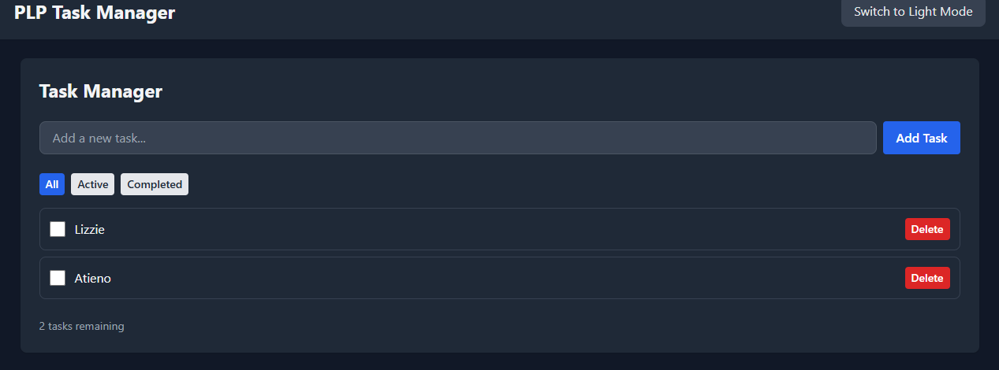
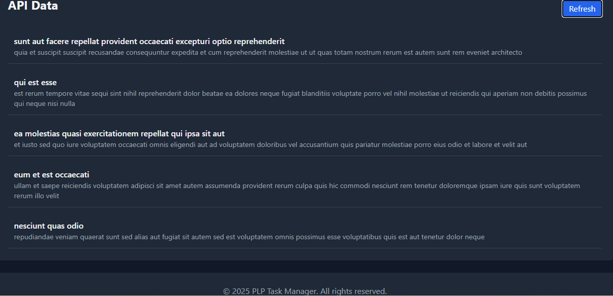
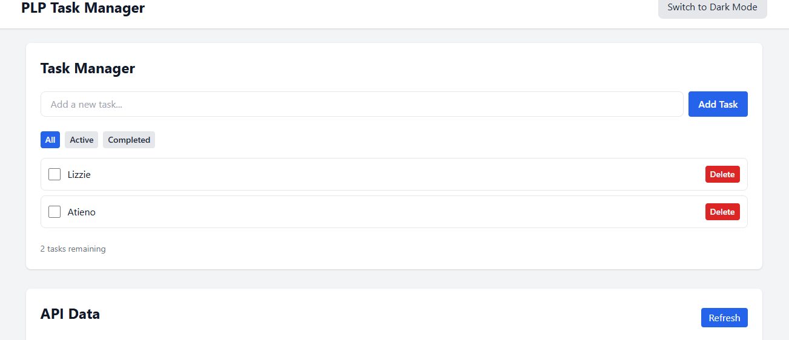

# PLP Task Manager

This is a **React.js application** built with **JSX** and **Tailwind CSS** that demonstrates component-based architecture, state management, custom hooks, and API integration.

---

## Features

### 1. Task Manager
- Add new tasks with a simple input form.
- Mark tasks as completed using checkboxes.
- Delete tasks individually.
- Filter tasks by:
  - **All**
  - **Active**
  - **Completed**
- Task data is persisted in **localStorage**, so tasks remain even after refreshing the page.
- Real-time task count is displayed for remaining tasks.

### 2. API Data Section
- Fetches sample data from **JSONPlaceholder** (`https://jsonplaceholder.typicode.com/posts`) and displays a list of posts.
- Includes a **Refresh** button to reload API data on demand.
- Handles loading state with a **"Loading..."** message.
- Handles empty results with a **"No data available"** message.

### 3. Styling
- Fully **responsive layout** for mobile, tablet, and desktop.
- Light/Dark mode support using Tailwind's `dark:` classes.
- Interactive elements include hover effects and subtle transitions.

### 4. Project Structure

src/
├── components/ # Reusable UI components: Button, TaskManager, Navbar, Footer
├── hooks/ # Custom hook: useLocalStorageTasks
├── api/ # API function: fetchSampleData
├── context/ # Optional: for theme/context providers
├── pages/ # Optional: page-level components
└── App.jsx # Main application component

---

## How it Works

1. **Task Manager**
   - The `TaskManager` component uses the `useLocalStorageTasks` custom hook.
   - This hook manages the list of tasks in React state and **saves them to localStorage** automatically whenever they change.
   - Users can:
     - Add tasks via the input form.
     - Toggle completion status with checkboxes.
     - Filter tasks using filter buttons.
     - Delete tasks individually.
   - Task statistics are updated in real-time.

2. **API Data Section**
   - The `App` component imports the `fetchSampleData` function from `src/api/fetchData.js`.
   - `useEffect` loads the API data when the page first renders.
   - The **Refresh** button allows the user to reload the data.
   - Conditional rendering ensures that **loading**, **empty**, or **data states** are displayed properly.

3. **Styling & Layout**
   - Tailwind CSS provides utility classes for layout, spacing, colors, and typography.
   - Dark mode is implemented using Tailwind’s `dark:` classes.
   - Components are modular and reusable:
     - `Button.jsx` supports different variants (`primary`, `secondary`, `danger`) and sizes (`sm`, `md`, `lg`).
     - `Navbar` and `Footer` provide consistent UI structure.
   - The layout is fully responsive and adjusts seamlessly across screen sizes.

---

## Screenshots

### Task Manager with tasks added
  
*Add, complete, delete, and filter tasks.*

### API Data Section
  
*Displays posts fetched from JSONPlaceholder.*

### Dark Mode (optional)
  
*Light/Dark mode styling applied.*

## Notes
- No backend is required; all task data is handled in **localStorage**.
- API data comes from a free public placeholder API.
- All components are **modular** and follow React best practices.

---

